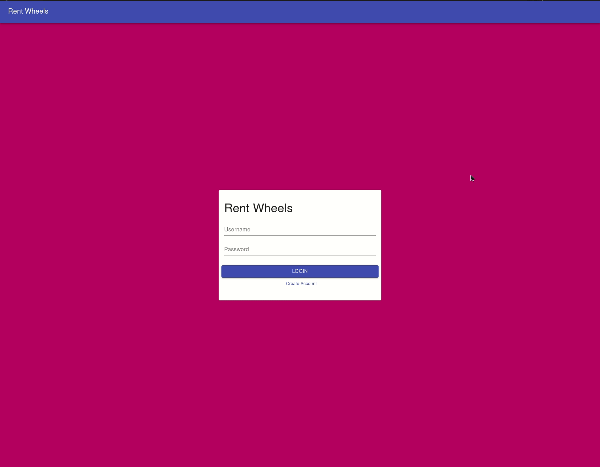

# Rent Wheels

## Overview

This is a CRUD web application for cars. Users can log into their accounts and manage their vehicles.

Technologies of note used in this application are:

-   React
-   Redux
-   Create-React-App
-   GraphQL
-   Apollo Client/Server
-   Typescript
-   Node.js
-   Postgres/ElephantSQL
-   Material-UI
-   styled-components
-   react-hook-form
-   Docker

## Table of Contents

-   [Quickstart](#quickstart)
    -   [Prerequistes](#prerequisites)
    -   [Starting Local Environment](#starting-development-environment)
-   [Project Requirements](#project-requirements)
-   [Development Process](#development-process)
-   [Limitations and Considerations](#limitations-and-considerations)

## Quickstart

### Prerequisites

To run the application, ensure that the following application are installed on your machine:

-   [Docker](https://www.docker.com/get-started)
-   [Docker Compose](https://docs.docker.com/compose/install/)
-   [yarn](https://classic.yarnpkg.com/en/docs/install/)
-   [node](https://nodejs.org/en/download/)
-   [git](https://git-scm.com/downloads)

### Starting Development Environment

Once you have the prerequiste applications installed on your machine, clone this repository to your machine by using the following command:

`git clone https://github.com/jrgaray/rent-wheels.git`

After the repository is cloned to your machine, `cd` into the client directory and run:

`yarn`

Finally, run the last command to build the projects in their docker containers:

`docker-compose up --build`

Once the following is visible, the application is ready for viewing/development:

    rent_wheels_server | 🚀 Server ready at http://localhost:4000/
    rent_wheels_client | Compiled successfully!
    rent_wheels_client |
    rent_wheels_client | You can now view client in the browser.
    rent_wheels_client |
    rent_wheels_client | Local: http://localhost:3000
    rent_wheels_client | On Your Network: http://172.21.0.2:3000
    rent_wheels_client |
    rent_wheels_client | Note that the development build is not optimized.
    rent_wheels_client | To create a production build, use yarn build.
    rent_wheels_client |

🎉🎉🎉🎉🎉🎉🎉🎉🎉🎉🎉🎉🎉🎉🎉🎉🎉🎉🎉🎉🎉

## Project Requirements

Create your own single page web application that allows users to perform queries and commands to cars that they own using React as your frontend and Graphql/Node.js as your backend.

-   Use Apollo Server for the backend
-   Use React for the front end
-   No need for a persistence layer, data can be stored in memory or in JSON files.
-   Implement error handling
-   BE CREATIVE
-   Have some form of form validation.
-   Things we'd like to see, material-ui components, React hooks, Apollo Client.
-   (Optional) If you want, you can create a database for persistence.

The Car schema can be a simple JSON object and should include { id: string, make: string, model: string, year: string, VIN: string } at a minimum.

## Development Process

After receiving the requirements for the coding challenge, I spent the night planning out my vision for the application and this is what I came up with: 

On Friday morning, I cleaned up the board a bit to organize my thoughts a bit more to this:

To summarize what I came up with was:

-   Plan: I created a plan for the seven days that I had to develop the application.
-   Stretch Goals: Planned several stretch goals that I could try to reach for if time permitted.
-   Backend Schema: Came up with a basic schema for my queries, mutations, and database.
-   Technologies: Listed all the technologies I could possibily use.
-   Front-End Mock: Drew out a flow for what the front end might look like and thought about how users might interact with the application.
-   Unknowns/Questions: Listed out unknowns that I would need to research.

Beyond the requirements, what I completed was:

-   Individual user accounts.
-   Hashed passwords in the database
-   Dockerized application.
-   Locked down the front end with private routes.
-   Hot reload in docker environment.
-   Half-way implementation of JWT authentication
-   Store user information in context.
-   Responsive.

My thought was rather than implementing client-side functionality, first build a secure application and a "good" development environment.

## Limitations and Considerations

My goal with this project was to:

-   Show my thought process in building the application
-   Display my procficiency with several technologies
-   Present my problem-solving skills with several technologies I'm not quite as familar with.

With the time constraint and the scope of the project, some things that could be improved upon would be:

-   Branching strategy (dev -> stage -> prod)
-   Breaking up the backend files a bit more to have structure. Example: resolvers.ts houses all of the queries and mutations. In a large application, this file would be huge.
-   I used typescript for front and backend development and there are some areas where typing could be better and some areas where I would want to research more into. Example: DialogController component on the front-end, graphql-code-generator package, and codegen.yml has an any typing.
-   More validation in the forms. Dropdowns over textfields for make, model, year. Pulling this data from some source rather than be hardcoded.
-   Image upload or pulling images of vechicles from another source.
-   Fully implement JWT token authentication. Only half of the process as is.
-   TDD approach. Some kind of testing cypress, jest, mocha, etc. Testing was completely omitted due to time, but certainly something I would want implement.
-   Other functionality that I thought of to extend this project:
    -   Adding notifications for when another user rents your car.
    -   Real-time updates to the car list also displaying that information using GQL subscriptions and websockets.
    -   Ability to edit user account.
    -   Filtering cars to more easily find a specific car.
    -   Better signaling when a user's car is active or inactive.
